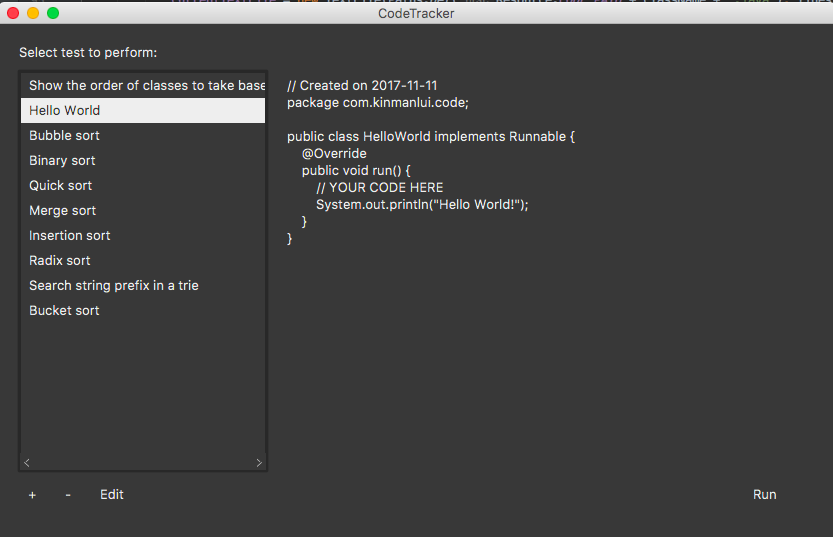
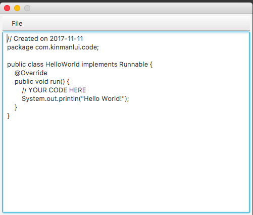
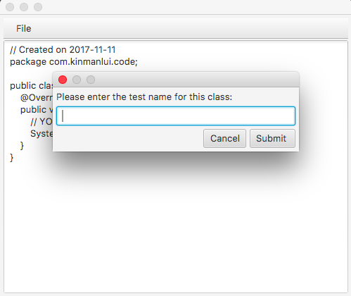

# What is it?
Have you ever forgetten about an com.kinmanlui.user that you have implemented in a project a long time ago? This is a notetaking app for anyone who is studying computer science. This app could save algorithms that you have learned and run them in the app to see the output. Try it and save your favourite algorithms!

# Screenshots 

# Features 
- Search field allows com.kinmanlui.user to search for algorithms (not implemented yet) 
- Save com.kinmanlui.user
- Edit com.kinmanlui.user in a customized text editor 
- To be continued 

# Build 
To be continued 

__Thanks for reading! :raised_hands:__
